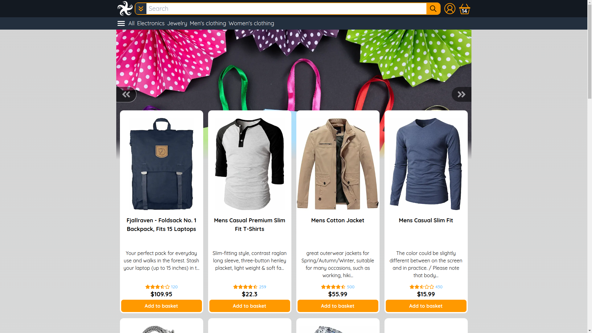

# Amazon inspired ecom site

## Features

-   Getting list of products
-   Adding products to cart
-   Search by category or title
-   Fully working Basket holding products and updating price
-   Login with 3rd party auth
-   Checkout page with full stripe integration
-   Clean responsive ui

## Getting started

```
npm i
npm run dev
```

### Environment

-Nextauth
NEXTAUTH_SECRET=
GITHUB_ID=
GITHUB_SECRET=
GOOGLE_CLIENT_ID=
GOOGLE_CLIENT_SECRET=

-Stripe
NEXT_PUBLIC_STRIPE_PUBLISHABLE_KEY=
STRIPE_SECRET_KEY=

## Tech stack

-   Next.js
-   Typescript
-   Tailwind
-   React query
-   Next-auth
-   Stripe api
-   Jotai
